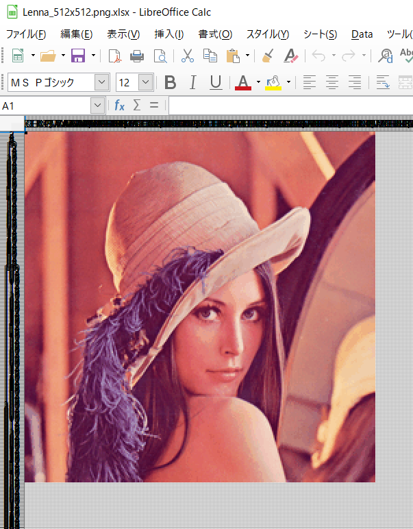

# xlspaint

A spreadsheet-painting tool



# prerequisites

- macOS, Linux, Windows
- viewer for .xlsx file

- Accepted image file format are {png, jpeg, gif}

# usage

## run

download latest release, or build it by yourself, then 

```console
xlspaint [your-favorite-image-file]
```

## get packages & build

```console
go get
go build
```

# License

MIT

